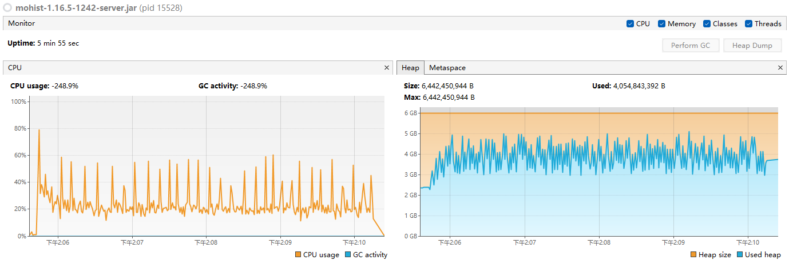

# 原文出处
https://aikar.co/2018/07/02/tuning-the-jvm-g1gc-garbage-collector-flags-for-minecraft

# Aikar's Flags的运行情况
- Aikar的调优侧重为优先取最低暂停时间，但不控制Mixed GC
- 在不同服务端核心的表现为：
  - 原版服良好，因为年轻代几乎可以一次就全部回收干净
  - 模组服吃力，因为年轻代不能一次回收干净，需要借助一定的幸存区进行缓冲，但幸存区太过于小，导致老年代快速膨胀，然后频繁触发Mixed GC

> GC日志中平均暂停时间30ms

# 对比我的情况

> GC日志中平均暂停时间40ms
