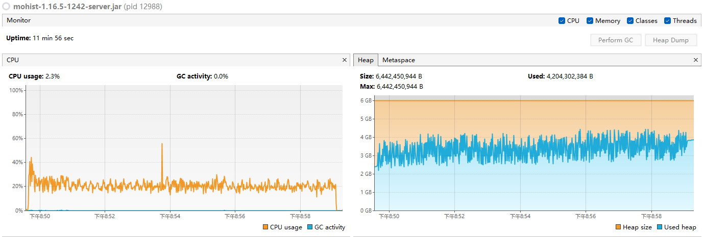
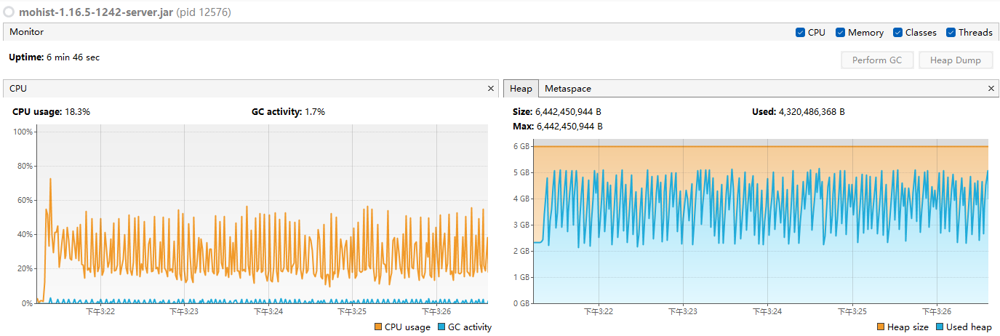
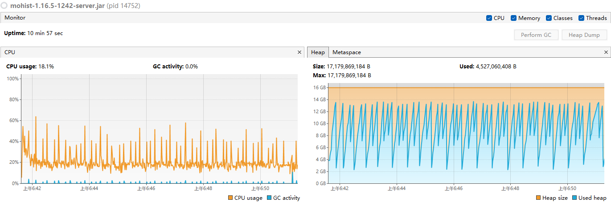
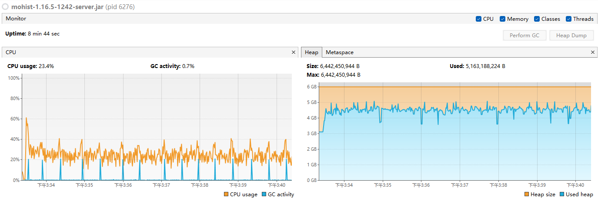
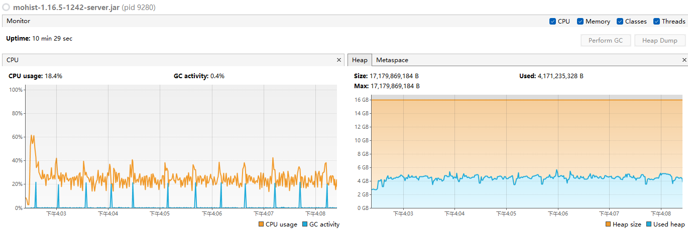

# 测试环境
系统：Win11 24H2  
CPU核心：16  
分配内存：4G、6G、16G  
JDK：Liberica JDK 21  
服务端核心：mohist 1.16.5  
模组数量：200  
持续负载：chunky区块生成  

# gc8表现
- ### 4G

- ### 6G

- ### 16G

> [!NOTE]  
> GC日志中平均暂停时间40ms  

> [!TIP]  
> 如果在运行时出现连续频繁CPU尖峰，应该尝试给大点内存  

# gc11表现
- ### 6G

- ### 16G

> [!NOTE]  
> GC日志中平均暂停时间0.3ms  

> [!NOTE]  
> CPU尖峰是这个GC的设计特色，无解  

# gc21表现
- ### 6G

- ### 16G

> [!NOTE]  
> GC日志中平均暂停时间0.01ms  

# gc21c表现
- ### 16G

> [!NOTE]  
> 只在高内存分配中见效明显  
